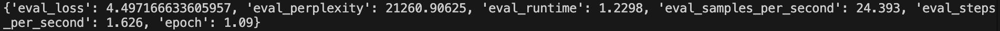
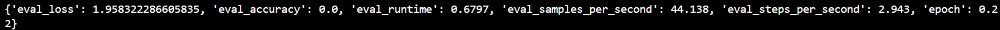
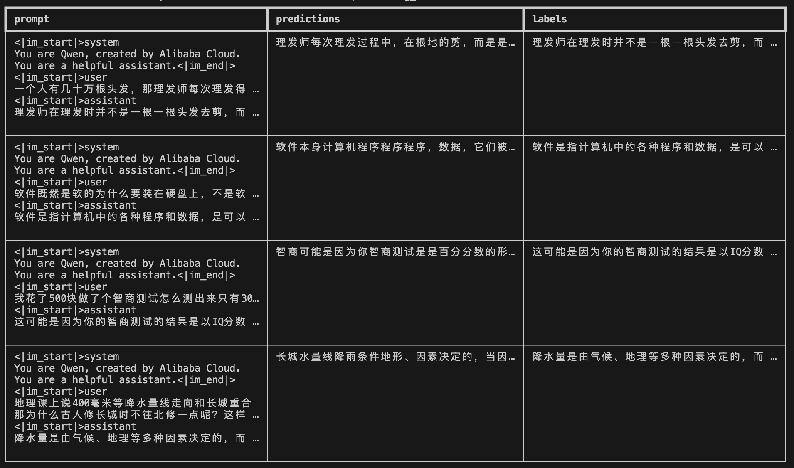
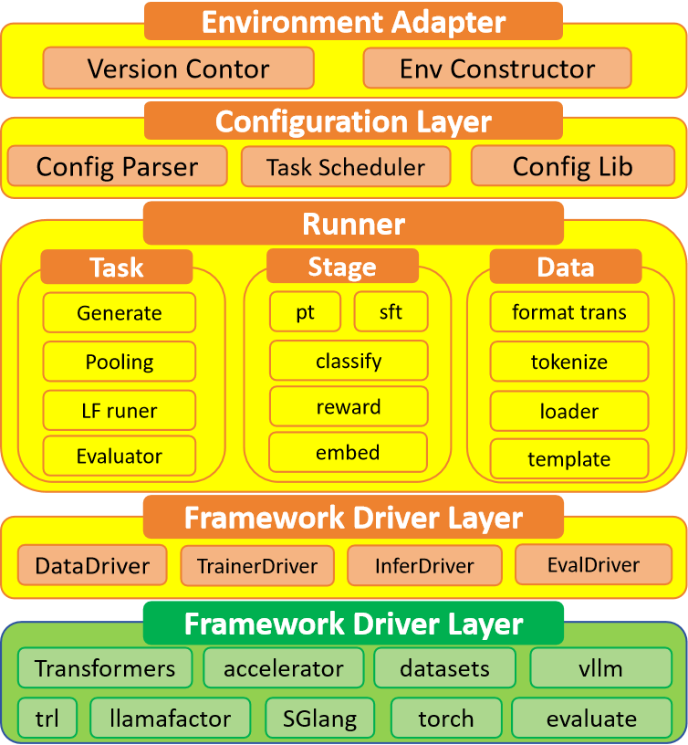
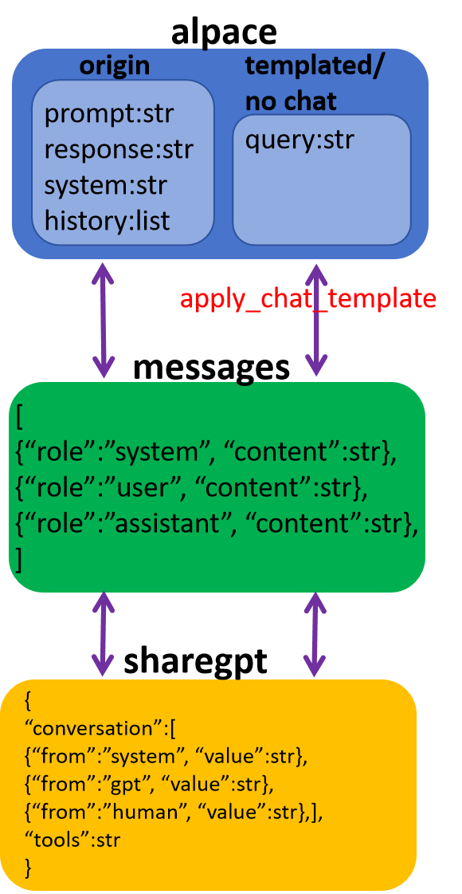
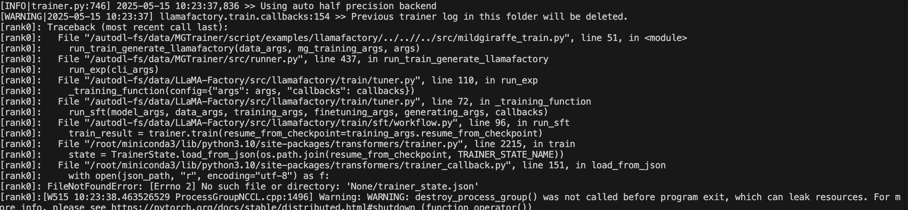

# MildGiraffeTrainer垂类任务训练推理一体框架（Beta-v1.0.0）

## 1. 介绍
MildGiraffeTrainer（温顺的长颈鹿训推套件）是一套面向多任务多阶段的训练推理一体化框架。本框架在兼容llamafactory训练后端的基础上，扩展支持分类模型、奖励模型、嵌入模型、rerank模型等多种垂类任务的训练能力，实现"训练-评测-推理"全流程闭环。通过统一的配置接口和模块化设计，使开发者能专注于算法创新而非工程适配。

## 2. 核心能力

### 2.1 多任务多阶段多模型架构支持
**任务类型**：生成式模型（兼容llamafactory）、分类模型、奖励模型、嵌入模型、rerank模型

**训练阶段**：支持预训练（PT）、监督微调（SFT）、直接偏好优化（DPO）、强化学习人类反馈（RLHF）全流程（**TODO**）

**模型架构**：适配Dense/MoE (**TODO**)架构，支持自定义模型扩展

### 2.2 工程化特性
**训推一体**：训练产出模型可直接对接vLLM推理框架，实现零成本工程部署

**环境智能**：基于uv环境管理工具构建动态环境适配层，支持Docker环境自动构建

**分布式训练**：集成DeepSpeed/Accelerate框架，支持多机多卡分布式训练

**强兼容性**：支持llamafactory原生所有训练方法，包括生成式模型的微调，后DPO，RLHF，lora等训练方法。

### 2.3 可视化监控
- 训练时数据与模版显示

- 内置多维度评测指标（BLEU/ROUGE/Accuracy等）




- 支持训练过程与下游效果的联合可视化



### 2.4 用户友好特性
**丰富训练指导模板**：提供20+训练和推理指导模板，用户可以根据模块快速上手进行训练和推理部署。

**参数兼容性**：参数兼容Transformer，Trl和Llamafactory参数，用户无感在多后端下进行切换。

### 2.5 软件架构介绍
MildGiraffeTrainer软件设计分为4层，分别是：环境适配层，配置层，运行实例层，框架驱动层和后端库。
- 环境适配层:主要用于自适应环境构建，减少用户在环境构建上的成本，使其更专注于模型训练本身。其次通过环境适配层，可以更利于框架的升级，为用户提供更先进技术的同时，保持向下兼容的能力。
- 配置层：用于提供统一的用户配置接口，屏蔽底层操作的差异性。使用户可以以相同的配置方法无感的操作丰富各异的训练功能。
- 运行实例层：用于提供各个功能的实际运行实例。该层的实现大大提升了框架的扩展性，为未来提供更丰富的功能以满足用户需求提供了可能。同时独立的实例可以保证运行程序的稳定性。
- 框架驱动层：框架驱动层构建了一个框架底层驱动代码，通过将不同的训练基础原子能力进行封装统一，为框架运行实例提供统一的原子能力驱动调用接口。大大简化了不同实例的实现，提供了代码的通用性和复用率。
- 后端库：该库集成了主流的用于深度学习训练推理的软件库作为该框架的基础，包括torch，transformer，trl，datasets，vllm，accelerate等等软件库。提升软件升级能力。



## 3. 应用介绍
### 3.1 环境构建
本架构提供了一个以最先进的uv软件库实现的训练时环境构建软件层，可以在开启训练任务前自动的下载相应的软件包，构建训练推理环境，实现用户无感式环境构建。

在vllm官方docker镜像v0.8.5下，训练脚本可以可以完成自定义环境构建。
```
cd /root/autodl-fs/MGTrainer/script/examples/classify/

bash train_classify.sh
```

对于要启用llamafactory功能，需要首先下载LLamafactory项目(推荐0.9.2)，然后修改`MGTrainer/script/env/build_env_llamafactory.sh`和`MGTrainer/src/mg_config.py`LLAMAFACTORY_PATH变量地址为下载的llamafactory项目地址即可。

### 3.2 数据
本套件定义了三类标准数据格式：`alpace`，`sharegpt`和`messages`。其中alpace和sharegpt两类是`输入数据格式`，messages是`内部数据格式`。用户用于训练的数据集类型必须是输入数据类型中的一种。

`alpace`数据格式
```
{"prompt": "好闷啊，打开车窗", "response": "好的，没有问题呢。"}
```
alpace标准对话数据有4个典型字段，"prompt","response","system","history"。其和一个message对话实现对应。而对于一个完整对话的字段，这里通常定义为"query"。
`messages`数据格式
```
[
  {"role": "user", "content": "好闷啊，打开车窗"},
  {"role": "assistant", "content": "好的，没有问题呢。"}
]
```
messages数据格式中，role通常包括三种角色："user","assistant"和"system"。对于一轮的数据，"user"中content对应于alpace的"prompt","assistant"中content对应于alpace中"response"。"system"中content对应于alpace中"system"。
对于多轮数据，最后一轮和一轮一致。其余轮数据成对的放入alpace的"history"字段中。
如果添加模版，直接使用tokenizer.apply_chat_template可以讲一个messages对话转换到alpace中的"query"字段中。
`sharegpt`数据格式
```
{
  "conversations": [
    {"from": "human", "value": "好闷啊，打开车窗"},
    {"from": "gpt", "value": "好的，没有问题呢。"}
  ],
  "tools": "{\"type\":\"op\", \"value\":2}"
}
```
对于通常需要添加模版的数据集，两种输入数据类型都可以。而对于不需要添加模版的数据集建议使用alpace格式。

为了方便用户进行数据转化，本框架`tools/dataformat_trans.py`提供了三种数据格式之间相互转化的工具程序。
<!--  -->


|task|Method|valid columns|template|
|-----|----------|----|--------|
|generate|pt|prompt|N|
|generate|sft|prompt/response|Y|
|pooling|classify|prompt/response|N|
|pooling|rm|choosen/rejected|N|
|pooling|embed|query/positive/nagative/nagative_X|N|

（PS:对于llamafactory的数据格式单独符合其数据格式即可。）

### 3.3 训练模式
为了适应垂类多任务特性。本框架将训练任务分为了2大类:`pooling`和`generate`。其中pooling按照任务类型又分为`classify`，`rm`, `embed`和`score`子任务。而generate按照训练阶段不同分为`pt`,`sft`阶段。

对于pooling任务，训练工具将不会为数据提供模版功能。如果需要为数据添加模版，需要用户使用本框架的提供的数据工具提前将数据进行转换。

除了使用框架提供的垂类任务训练方法，本框架还兼容llamafactory训练框架。提供其作为训练后端，能够使用其提供的丰富的训练功能的同时对后端的切换没有任何感觉。并且环境搭建脚本可以自动的为其运行过程搭建训练环境。

使用llamafactory的方法也非常的简单，直接在普通生成训练状态下，添加`--llamafactory`参数，并传递llamafactory配置文件，其会自动搭建llamafactory运行环境，同期启用llamafactory进行训练。可以参考：`MGTrainer/script/examples/llamafactory/train_lf_sft_full.sh`

### 3.4 推理部署
该框架提供了训推一体机制。直接使用vllm作为推理后端，直接将训练完成的垂类任务部署为可以通过API访问的服务。大大提升了工程落地速度，降低部署成本。

## 5. 最佳实践


## FAQ
### 运行LLamafactory出错
出现`FileNotFoundError: [Errno 2] No such file or directory: ！'None/trainer_state.json'`

请将llamafactory配置例如`LLaMA-Factory/examples/train_full/llama3_full_sft.yaml`中`resume_from_checkpoint`注释掉即可。
